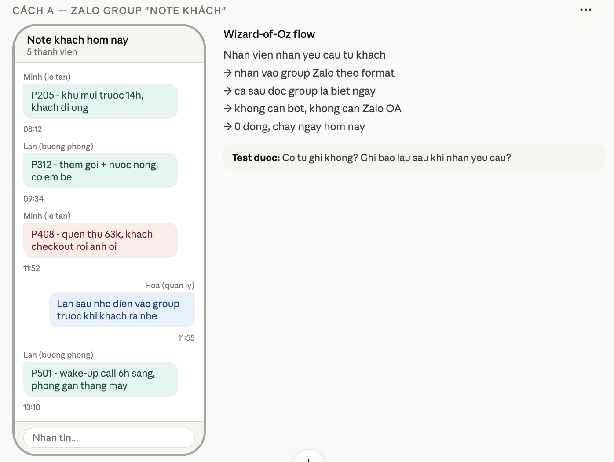
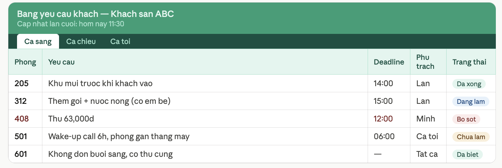
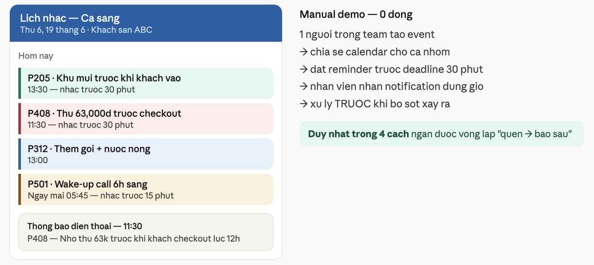
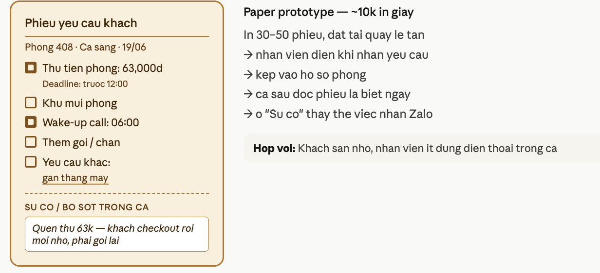

# Day 17 — Main Studio | Build-up Chain

## Thông tin học viên

| Trường | Điền |
|---|---|
| Mã học viên | 2A202600709 |
| Họ tên | Hà Trung Kiên|
| Dự án đang làm | Opstream - hỗ trợ lễ tân khách sạn |
| Vai trò trong dự án | Tìm ra 4 phương pháp rẻ nhất |

## Build-up Chain
| Hạng mục | Link / ghi chú |
|---|---|
| Day 16 artifact 02 | build-chain.html |
| Present board / frame / file | build-chain.html |
| Công cụ làm studio này | Claude |

---

## Phần 1 — JTBD Checkpoint

| Câu hỏi | Trả lời |
|---|---|
| Core JTBD hiện tại là gì? | Nhân viên khách sạn cần nắm đúng và đủ yêu cầu đặc biệt của từng khách — để phục vụ đúng mà không cần ai nhắc lại, kể cả khi bàn giao ca |
| Current workflow hiện tại là gì? | Khách check-in → nói yêu cầu miệng hoặc nhắn Zalo → lễ tân nhớ hoặc ghi tay vào sổ → bàn giao ca bằng miệng → ca sau thiếu thông tin → sai sót xảy ra → nhân viên báo ngược lại quản lý |
| Pain step đau nhất là gì? | Yêu cầu khách không được ghi lại tập trung → ca sau không biết → khách phải nhắc lại hoặc bị phục vụ sai → nhân viên phát hiện sót và phải nhắn riêng cho quản lý ("em quên thu 63k phòng 408 ạ") |
| AI leverage point nằm ở bước nào? | Bước chuyển từ "yêu cầu rải rác nhiều nơi" → "note tập trung theo phòng, cả team thấy được, có nhắc đúng giờ, không cần báo ngược sau" |
| Điểm nào còn mơ hồ nhất? | Nhân viên không ghi yêu cầu khách vì lười — hay vì không thấy hậu quả trực tiếp với bản thân họ? |

---

## Phần 2 — Hypothesis Card

> **"Nhân viên khách sạn chịu ghi lại yêu cầu đặc biệt của khách vào một chỗ chung và cập nhật trạng thái xử lý — thay vì để thông tin rải rác, bị mất khi bàn giao ca, và phải báo ngược lại quản lý khi phát hiện sót."**

| Câu hỏi | Trả lời |
|---|---|
| Hypothesis này thuộc phần nào của dự án? | Value risk — nhân viên có thấy đủ lợi ích để thay đổi thói quen ghi chép không |
| Nếu nó sai thì chuyện gì sập / yếu đi? | Nhân viên vẫn nhớ miệng, vẫn bỏ sót, vẫn nhắn "em quên thu 63k" sau khi đã xảy ra — sản phẩm không phá được vòng lặp này, mọi tính năng AI phía trên đều không có input |
| Vì sao chọn hypothesis này hôm nay? | Đây là hành vi nền quan trọng nhất. Nếu nhân viên không chịu ghi tập trung, toàn bộ hệ thống theo dõi yêu cầu sẽ vô nghĩa. Và nếu không có nhắc đúng giờ, vòng lặp "quên → báo sau" vẫn tiếp diễn. |

---

## Phần 3 — Current Approach Snapshot

| Câu hỏi | Trả lời |
|---|---|
| Dự án đã từng làm / đang định làm gì để test hypothesis này? | Đang định build app riêng: nhân viên nhập yêu cầu khách, AI tổng hợp theo phòng, hệ thống tự nhắc nhở trước checkout, quản lý xem dashboard tổng |
| Cách đó có cần build gì tương đối lớn không? | Có — cần backend, giao diện app, hệ thống notification, tích hợp với kênh nhắn tin |
| Cách đó tốn gì? | 4–8 tuần dev / toàn bộ scope frontend + backend / cần onboard và train nhân viên / cần nhân viên cài app mới |
| Vì sao cách hiện tại đang đắt hoặc chậm? | Phải build xong hoàn toàn mới test được hành vi ghi chép thật của nhân viên — không biết họ có chịu dùng không cho đến khi đã đầu tư lớn |
| Câu hỏi tự ép mình hỏi lại? | Còn cách nào để biết nhân viên có chịu ghi và cập nhật yêu cầu không — mà không cần build app? |

**Còn cách nào rẻ hơn để test hypothesis này không? → Có. 4 cách dưới đây.**

---

## Phần 4 — 4 Hướng Test Rẻ Hơn
---

### Cách A — Zalo Group "Note Khách"

| Trường | Nội dung |
|---|---|
| Tên hướng test | Zalo Group "Note Khách" |
| Loại artifact | Wizard-of-Oz flow + mock Zalo conversation |
| Người dùng sẽ thấy gì? | Một group Zalo riêng tên "Note khách hôm nay" — ai nhận yêu cầu từ khách thì nhắn vào group theo format đơn giản: Phòng + Yêu cầu + Deadline |
| Phía sau bạn sẽ làm gì? | Không cần bot, không cần Zalo OA — nhân viên tự nhắn, cả team đều thấy. Cuối ca 1 người tổng hợp lại bằng tay |
| Nó đang test hypothesis nào? | Nhân viên có chịu tự ghi yêu cầu khách vào chỗ chung không, và ghi có đủ không |
| Vì sao nó rẻ hơn current approach? | 0 đồng, setup 20 phút, không cần code, dùng đúng Zalo nhân viên đang dùng hàng ngày — không có rào cản adoption |
| Nó giúp học được gì? | Có tự ghi không? Ghi bao lâu sau khi nhận yêu cầu? Loại yêu cầu nào hay bị bỏ sót? Vòng lặp "quên → báo sau" có giảm không? |
| Nó chưa giúp học được gì? | Thông tin vẫn nằm rải rác trong chat, không có nhắc đúng giờ, khó tổng hợp khi nhiều phòng |
| Artifact A nằm ở đâu? | |

**Mock conversation:**
```
Minh (lễ tân):       P205 — khử mùi trước 14h, khách dị ứng
Lan (buồng phòng):   P312 — thêm gối + nước nóng, có em bé
Minh (lễ tân):       ⚠️ P408 — quên thu 63k, khách checkout rồi anh ơi
Hoa (quản lý):       Lần sau nhớ điền vào group trước khi khách ra nhé
Lan (buồng phòng):   P501 — wake-up call 6h sáng, phòng gần thang máy
```

---

### Cách B — Google Sheet "Bảng Yêu Cầu Khách"

| Trường | Nội dung |
|---|---|
| Tên hướng test | Google Sheet "Bảng Yêu Cầu Khách" |
| Loại artifact | Fake-door — Google Sheet thật điền dữ liệu mẫu |
| Người dùng sẽ thấy gì? | Link Google Sheet được ghim trong group Zalo — mỗi phòng 1 dòng, có cột Yêu cầu / Deadline / Người phụ trách / Trạng thái. Nhân viên tự tick "Đã xử lý" khi hoàn thành |
| Phía sau bạn sẽ làm gì? | Tạo sheet template sẵn, gửi link vào group. Nhắc nhân viên điền khi nhận yêu cầu. Không cần dạy thêm — ai cũng biết dùng Google Sheet |
| Nó đang test hypothesis nào? | Nhân viên có chịu ghi và cập nhật trạng thái yêu cầu vào một chỗ chung không |
| Vì sao nó rẻ hơn current approach? | 0 đồng, setup 1 giờ, không cần code, không cần app mới |
| Nó giúp học được gì? | Tỉ lệ tick "đã xử lý" thực tế, loại yêu cầu nào phổ biến nhất, ca nào hay bỏ sót, cột nào hay để trống |
| Nó chưa giúp học được gì? | Nhân viên phải nhớ mở link — không tự nhắc khi đến giờ deadline |
| Artifact B nằm ở đâu? |  |

**Sheet mẫu:**

| Phòng | Yêu cầu | Deadline | Người phụ trách | Trạng thái |
|---|---|---|---|---|
| 205 | Khử mùi trước khi vào | 14:00 | Lan | ✅ Đã xử lý |
| 312 | Thêm gối + nước nóng (có em bé) | 15:00 | Lan | 🔄 Đang làm |
| 408 | Thu 63,000đ | 12:00 | Minh | ⚠️ Bỏ sót |
| 501 | Wake-up call 6h sáng | 06:00 | Ca tối | ⏳ Chưa làm |
| 601 | Không dọn buổi sáng, có thú cưng | — | Tất cả | ✅ Đã biết |

---

### Cách C — Google Calendar Nhắc Giờ

| Trường | Nội dung |
|---|---|
| Tên hướng test | Google Calendar Nhắc Giờ |
| Loại artifact | Manual demo script + screenshot mock Google Calendar |
| Người dùng sẽ thấy gì? | Notification điện thoại đúng giờ: "P408 — nhắc thu 63k trước checkout 12h". Không cần nhớ, không cần mở app riêng |
| Phía sau bạn sẽ làm gì? | 1 người trong team tạo event Google Calendar chia sẻ cho cả nhóm mỗi khi có yêu cầu mới. Đặt reminder trước deadline 30–60 phút |
| Nó đang test hypothesis nào? | Nhắc đúng giờ có giúp nhân viên xử lý yêu cầu trước khi sót xảy ra không — thay vì báo ngược lại quản lý sau |
| Vì sao nó rẻ hơn current approach? | 0 đồng, setup 30 phút, dùng Google Calendar miễn phí, không cần build notification system |
| Nó giúp học được gì? | Nhắc giờ có thật sự giảm bỏ sót không? Nhân viên xử lý kịp sau notification không? Đây là cách duy nhất trong 4 cách ngăn được sót trước khi xảy ra |
| Nó chưa giúp học được gì? | Vẫn cần 1 người tạo event tay mỗi khi có yêu cầu mới. Nhân viên cần có tài khoản Google |
| Artifact C nằm ở đâu? |  |

**Mock calendar:**
```
Hôm nay — Ca sáng

11:30  [nhắc 30 phút trước]  P408 · Thu 63k trước checkout 12h ⚠️
13:00                         P312 · Thêm gối + nước nóng cho em bé
13:30  [nhắc 30 phút trước]  P205 · Khử mùi trước khi khách vào 14h
Ngày mai 05:45                P501 · Wake-up call lúc 6h sáng
```

---

### Cách D — Phiếu Note In Sẵn + Ô Báo Sót

| Trường | Nội dung |
|---|---|
| Tên hướng test | Phiếu Note In Sẵn + Ô Báo Sót |
| Loại artifact | Paper prototype — PDF in được + ảnh chụp phiếu đã điền mẫu |
| Người dùng sẽ thấy gì? | Tờ phiếu nhỏ đặt tại quầy lễ tân — khi khách có yêu cầu đặc biệt, nhân viên điền tờ phiếu và kẹp vào hồ sơ phòng. Có thêm ô "Sự cố / Bỏ sót" cuối phiếu thay vì nhắn Zalo riêng cho quản lý |
| Phía sau bạn sẽ làm gì? | In 30–50 phiếu, nhờ 1 khách sạn quen dùng thử 3 ngày. Cuối ngày đếm bao nhiêu ô được điền và bao nhiêu ô "Sự cố" xuất hiện |
| Nó đang test hypothesis nào? | Nhân viên có tự ghi yêu cầu khách khi đã có mẫu sẵn không, và loại sót nào phổ biến nhất |
| Vì sao nó rẻ hơn current approach? | ~10k tiền in giấy, setup 15 phút, không cần điện thoại hay app |
| Nó giúp học được gì? | Loại yêu cầu nào phổ biến nhất, nhân viên điền tự nhiên hay cần nhắc, loại sót nào hay gặp, format nào dễ đọc nhất |
| Nó chưa giúp học được gì? | Không realtime, phiếu dễ thất lạc, không tổng hợp được data khi nhiều phòng, không ngăn được sót trước khi xảy ra |
| Artifact D nằm ở đâu? |  |

**Mẫu phiếu:**
```
┌──────────────────────────────────────────┐
│ Phiếu yêu cầu khách — Phòng 408 · Ca sáng│
├──────────────────────────────────────────┤
│ ☑  Thu tiền phòng: 63,000đ · Trước 12:00 │
│ ☐  Khử mùi phòng                         │
│ ☑  Wake-up call: 06:00                   │
│ ☐  Thêm gối / chăn                       │
│ ☐  Yêu cầu khác: ____________________   │
├──────────────────────────────────────────┤
│ Sự cố / Bỏ sót trong ca:                │
│ Quên thu 63k — khách checkout rồi mới nhớ│
└──────────────────────────────────────────┘
```

---

## Phần 5 — Artifact Checklist

| Cách | Đã có artifact chưa? | Artifact là gì? | Link / ảnh / frame |
|---|---|---|---|
| A | ✅ | Mock Zalo conversation — Wizard-of-Oz flow |  |
| B | ✅ | Google Sheet thật điền dữ liệu mẫu |  |
| C | ✅ | Screenshot mock Google Calendar + manual demo script |  |
| D | ✅ | PDF phiếu in được + ảnh phiếu đã điền mẫu |  |

---

## Phần 5b — So Sánh Nhanh 4 Cách

| Tiêu chí | A — Zalo Group | B — Google Sheet | C — Calendar | D — Phiếu giấy |
|---|---|---|---|---|
| Nhanh hơn current approach ở đâu? | Chạy ngay hôm nay, 0 rào cản | Setup 1 giờ, không cần code | Setup 30 phút, không cần code | In giấy xong là dùng được |
| Rẻ hơn current approach ở đâu? | 0 đồng | 0 đồng | 0 đồng | ~10k tiền in |
| Gần với hành vi thật tới đâu? | Cao — Zalo nhân viên dùng hàng ngày | Trung bình — phải nhớ mở link | Cao — notification tự bật | Cao — thao tác quen tại quầy |
| Học được điều gì rõ nhất? | Có tự ghi không, ghi đủ không | Tỉ lệ xử lý, loại yêu cầu phổ biến | Nhắc giờ có giảm bỏ sót không | Loại sót nào hay gặp nhất |
| Giới hạn lớn nhất là gì? | Thông tin vẫn rải trong chat | Không tự nhắc khi đến giờ | Vẫn cần tạo event tay | Không scale, dễ thất lạc |

**Chốt nhanh:**
- Thuyết phục nhất khi present: Cách C — vì là cách duy nhất ngăn được vòng lặp "quên → báo sau" trước khi xảy ra
- Dễ bị lớp phản biện nhất: Cách C — nhân viên cần tài khoản Google, vẫn cần người tạo event tay

---